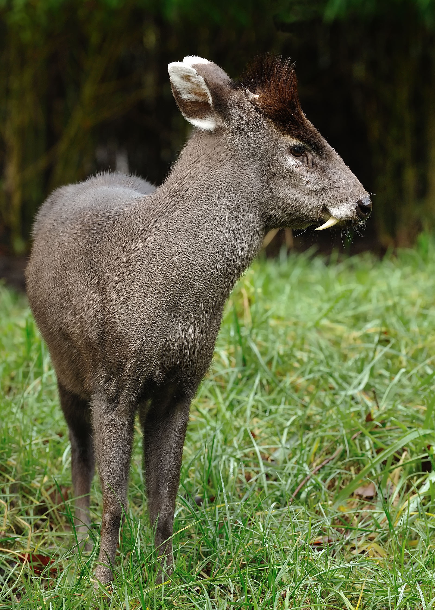

# Personal Notes

\- Carson Trego is a statistician working with the university of Nebraska-Lincoln. Carson is most well known for the Carson Distribution, which is a special case of the Gamma distribution. 


# Favorite Animal: Tuffed Deer

{width=50% height=50%}

# Favorite Charts 1/2
```{r}
itero=0.1
xx=seq(-5,5,.001)
xxb=seq(.01,.99,.001)

lineseq=seq(0,1,.1)

yy1=dnorm(xx)
yy2=pnorm(xx)

xcord=2

plot(xx,yy2,col="blue",ylim=c(-xcord+2,xcord-1), xlim=c(-xcord,xcord))
points(xx,yy1)
for (x in lineseq){
  abline(h=x);
  abline(v=qnorm(x))
}
```

# Favorite Charts 2/2
```{r}
funcy <- function (x, y) {
  return (dnorm(x,mean=0, sd=35/y))
}

x <- seq(-40, 40, length= 100)
y <- seq(1, 5, length= 30)
z <- outer(x, y, funcy)

z[is.na(z)] <- 1
op <- par(bg = "grey10")

xpx=15

persp(x, y, z, theta = xpx*10, phi = 15, expand = 0.5, col = "green", border="darkgreen")
xpx=xpx+1
```
